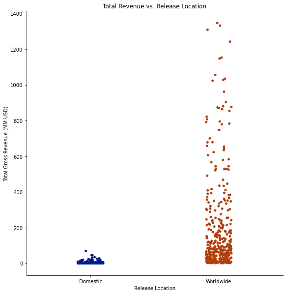
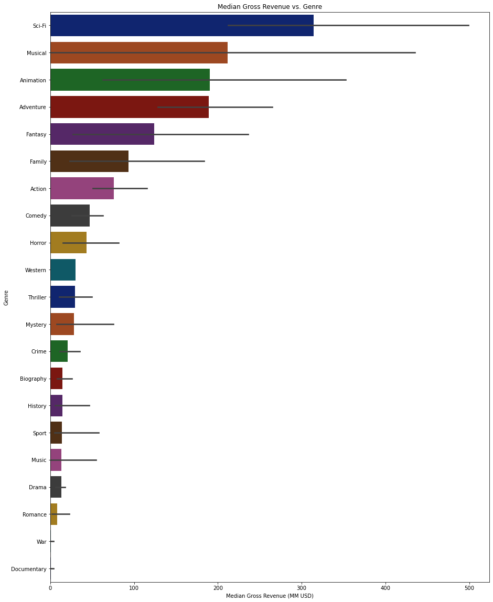
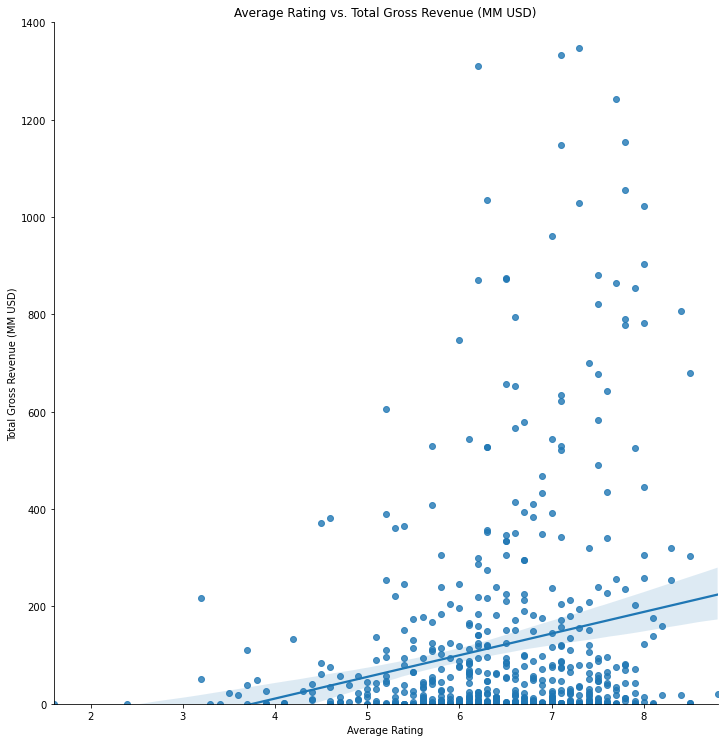

# Microsoft Movie Studio - Characteristics of a Successful Movie

**Author**: [Drake Fitzsimmons](mailto:fitzsimmons.drake@gmail.com)


## Business Problem

Microsoft is looking for recommendations on what movies do the best at the box office. They will use this information to make informed decisions on starting a new movie studio. They would like actionable insights on past movie performance to help decide what types of films to create. This analysis will review data provided by the client from IMDb and Box Office Mojo to create recommendations that Microsoft can use in their new business venture. In this project, total gross revenue was used to determine the success of a movie. This was the most logical choice with the data given, but other alternatives are discussed in the Future Work section.

## Data

Data was provided by the client from IMDb and Box Office Mojo in the form of 3 CSV files. Data included the following information:

* Movie Title
* Release Year
* Runtime
* Genre
* IMDb Rating
* IMDb Number of Votes
* Studio
* Domestic Gross
* Foreign Gross
* Year

Only movies released between 2016 and 2018 were reviewed in order to provide Microsoft with the most up to date recommendations. The dataset did not have movies released more recently than 2018. A total of 604 movies were included in the analysis.

## Methods

The data was cleaned using pandas dataframes. Seaborn was used to make visuals to analyze relationships of various variables and come to conclusions on what are the characteristics of successful movies.


## Business Recommendations

### Effect of Release Location on Total Revenue

There were 211 movies released domestically and 393 movies that were released worldwide. The relationship between total gross revenue and release location was analyzed. 
    

    


The graph clearly shows that movies released worldwide have a larger total gross revenue than movies only released domestically.

Microsoft should consider releasing their movies worldwide in order to make the most revenue.

### Effect of Genre on Total Revenue

The relationship between total gross revenue and genre was analyzed.
    


The graph shows that movies in the Sci-Fi category have the greatest median gross revenue. This is followed by the Musical Genre, Animation, and Adventure genres.

Microsoft should consider making movies that fall under the following genres, in order: Sci-Fi, Musical, Animation, and Adventure.

### Effect of Rating on Total Revenue

The relationship between IMDb rating and Total Revenue was analyzed.
    


The graph shows there is a positive correlation between Average Rating and Total Gross Revenue.


Microsoft should consider making audience favorite movies in order to make more revenue.

## Conclusion

After analyzing data from IMDb and Box Office Mojo, we have the following recommendations for Microsoft in order to create the most Total Gross Revenue for the movies that they create:

* Release films worldwide, not just domestically.
* Make Sci-Fi, Musical, Animation, or Adventure movies.
* Make movies which audiences enjoy and rate highly.

## Future Work

This project is just a preliminary analysis and more work could be done to provide additional recommendations for Microsoft. The following is a list of additional work that could be done:

* This analysis based success on total gross revenue. Microsoft may consider other metrics of success such as profit.


* A comparison between existing movie studios could be completed to determine which studios are successful. Microsoft could consider emulating or partnering with the most successful studios.


* Success of movies could be compared with actors and directors to determine if Microsoft should hire specific people.


* An analysis of movie runtime could be performed to determine if it affects movie success.

## Repository Structure

```
├── zippedData
├── student.ipynb
├── output_107_0.png
├── output_125_0.png
├── output_129_0.png
├── Presentation.pdf
└── README.md
```
